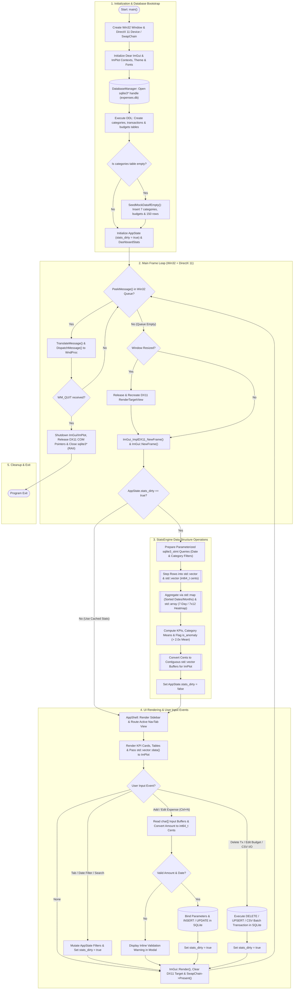

```mermaid
flowchart TD
    %% ==========================================
    %% 1. INITIALIZATION & DATABASE BOOTSTRAP
    %% ==========================================
    subgraph Init ["1. Initialization & Database Bootstrap"]
        Start(["Start: main()"]) --> InitWin["Create Win32 Window & DirectX 11 Device / SwapChain"]
        InitWin --> InitImGui["Initialize Dear ImGui & ImPlot Contexts, Theme & Fonts"]
        InitImGui --> OpenDB[("DatabaseManager: Open sqlite3* handle (expenses.db)")]
        OpenDB --> CreateTables["Execute DDL: Create categories, transactions & budgets tables"]
        CreateTables --> CheckEmpty{"Is categories table empty?"}
        CheckEmpty -->|"Yes"| SeedDB["SeedMockDataIfEmpty(): Insert 7 categories, budgets & 150 rows"]
        CheckEmpty -->|"No"| InitState["Initialize AppState (stats_dirty = true) & DashboardStats"]
        SeedDB --> InitState
    end

    %% ==========================================
    %% 2. MAIN APPLICATION LOOP (60 FPS)
    %% ==========================================
    subgraph MainLoop ["2. Main Frame Loop (Win32 + DirectX 11)"]
        InitState --> PollMsg{"PeekMessage() in Win32 Queue?"}
        PollMsg -->|"Yes"| DispatchMsg["TranslateMessage() & DispatchMessage() to WndProc"]
        DispatchMsg --> CheckQuit{"WM_QUIT received?"}
        CheckQuit -->|"Yes"| Cleanup
        CheckQuit -->|"No"| PollMsg

        PollMsg -->|"No (Queue Empty)"| CheckResize{"Window Resized?"}
        CheckResize -->|"Yes"| ResizeDX["Release & Recreate DX11 RenderTargetView"]
        ResizeDX --> NewFrame["ImGui_ImplDX11_NewFrame() & ImGui::NewFrame()"]
        CheckResize -->|"No"| NewFrame

        NewFrame --> CheckDirty{"AppState.stats_dirty == true?"}
    end

    %% ==========================================
    %% 3. ANALYTICS & DATA STRUCTURE PIPELINE
    %% ==========================================
    subgraph Analytics ["3. StatsEngine Data Structure Operations"]
        CheckDirty -->|"Yes"| PrepSQL["Prepare Parameterized sqlite3_stmt Queries (Date & Category Filters)"]
        PrepSQL --> FetchVec[["Step Rows into std::vector<Transaction> & std::vector<Budget> (int64_t cents)"]]
        FetchVec --> AggMap[["Aggregate via std::map (Sorted Dates/Months) & std::array (7-Day / 7x12 Heatmap)"]]
        AggMap --> CalcKPIs["Compute KPIs, Category Means & Flag is_anomaly (> 2.0x Mean)"]
        CalcKPIs --> BuildPlotVec[["Convert Cents to Contiguous std::vector<double> Buffers for ImPlot"]]
        BuildPlotVec --> ClearDirty["Set AppState.stats_dirty = false"]
    end

    %% ==========================================
    %% 4. UI RENDERING & USER INPUT HANDLING
    %% ==========================================
    subgraph UI ["4. UI Rendering & User Input Events"]
        CheckDirty -->|"No (Use Cached Stats)"| RenderShell["AppShell: Render Sidebar & Route Active NavTab View"]
        ClearDirty --> RenderShell

        RenderShell --> RenderCharts["Render KPI Cards, Tables & Pass std::vector<double>::data() to ImPlot"]
        RenderCharts --> CheckInput{"User Input Event?"}

        CheckInput -->|"None"| PresentFrame["ImGui::Render(), Clear DX11 Target & SwapChain->Present()"]

        CheckInput -->|"Tab / Date Filter / Search"| UpdateFilter["Mutate AppState Filters & Set stats_dirty = true"]
        UpdateFilter --> PresentFrame

        CheckInput -->|"Add / Edit Expense (Ctrl+N)"| ReadModal["Read char[] Input Buffers & Convert Amount to int64_t Cents"]
        ReadModal --> ValidateTx{"Valid Amount & Date?"}
        ValidateTx -->|"No"| ShowWarn["Display Inline Validation Warning in Modal"]
        ShowWarn --> PresentFrame
        ValidateTx -->|"Yes"| WriteTx[("Bind Parameters & INSERT / UPDATE in SQLite")]
        WriteTx --> FlagDirty1["Set stats_dirty = true"]
        FlagDirty1 --> PresentFrame

        CheckInput -->|"Delete Tx / Edit Budget / CSV I/O"| MutateSQL[("Execute DELETE / UPSERT / CSV Batch Transaction in SQLite")]
        MutateSQL --> FlagDirty2["Set stats_dirty = true"]
        FlagDirty2 --> PresentFrame

        PresentFrame --> PollMsg
    end

    %% ==========================================
    %% 5. SHUTDOWN & RESOURCE CLEANUP
    %% ==========================================
    subgraph Shutdown ["5. Cleanup & Exit"]
        Cleanup["Shutdown ImGui/ImPlot, Release DX11 COM Pointers & Close sqlite3* (RAII)"] --> End(["Program Exit"])
    end

```